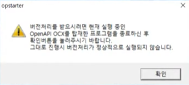

# 키움증권 OpenAPI 사용법
https://www1.kiwoom.com/h/customer/download/VOpenApiInfoView?dummyVal=0
→←↑↓
## OpenAPI 세팅
- 도구 상자/일반 우클릭 → 항목 선택 → COM 구성요소 → KHOpenAPI Control 추가
- 참조 우클릭 → COM에서 KHOpenAPI Control 추가
- 윈도우 시작 메뉴에서 **"Developer Command Prompt for VS"**
```
aximp.exe "C:\OpenAPI\khopenapi.ocx"
```
→ **AxKHOpenAPILib** 생성

### OpenAPI 실행 테스트
``` C#
private void MainForm_Shown(object sender, EventArgs e)
{
    AxkhOpenapi.CommConnect();
}
```


**주의** : 확인 누르기 전에 GUI + VS IDE 종료 후 확인 누르기